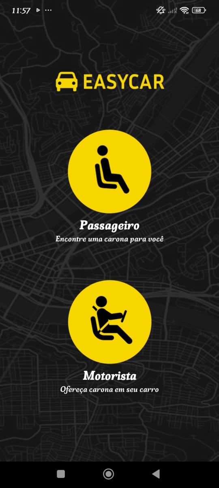
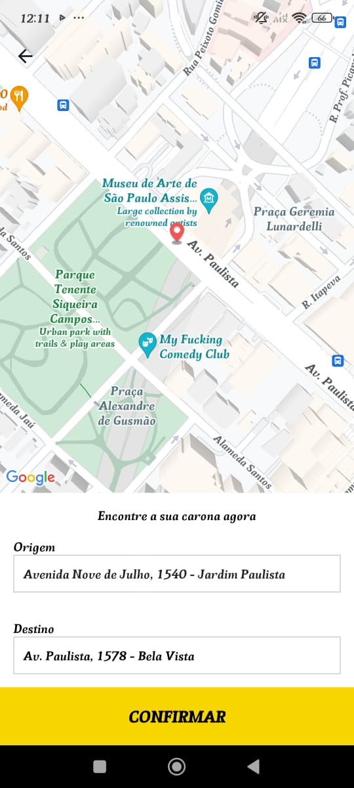
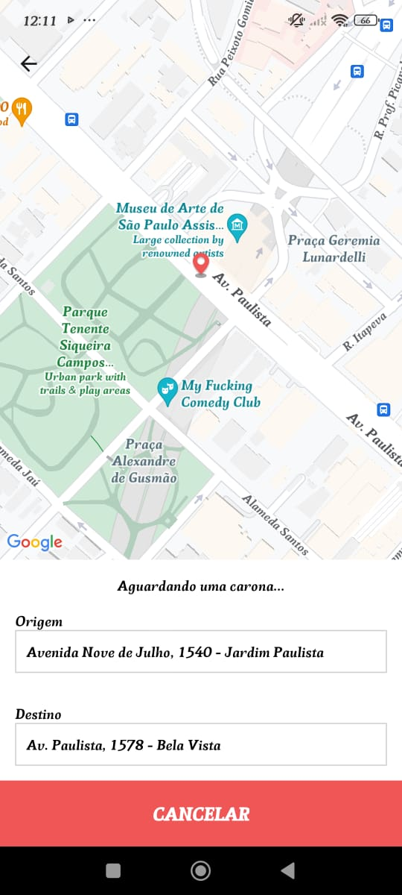
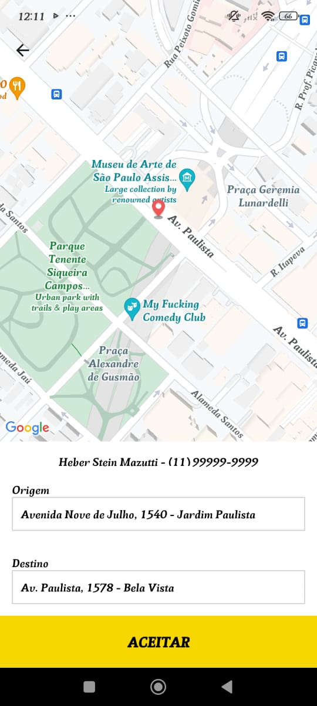
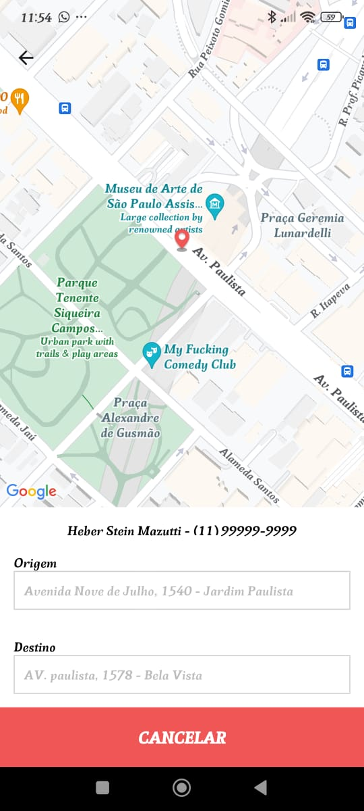
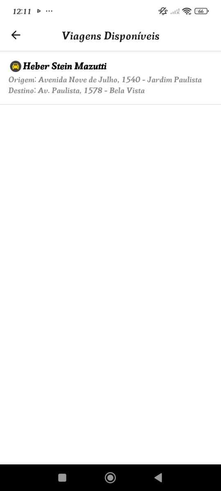

## 🚗 EasyCar - Conectando Passageiros e Motoristas (Mobile)

### 🚀 Visão Geral

O EasyCar é um aplicativo mobile que conecta passageiros e motoristas em tempo real, utilizando geolocalização para facilitar corridas e melhorar a experiência de transporte. Com uma interface intuitiva e funcionalidades modernas, o EasyCar oferece uma solução eficiente para o transporte urbano.

Este repositório contém o Frontend Mobile do projeto, desenvolvido com React Native e Expo.

### ✨ Características do Projeto

✅ Geolocalização em Tempo Real – Rastreamento de motoristas e passageiros em tempo real.
<br>
✅ Interface Intuitiva – Design moderno e fácil de usar para passageiros e motoristas.
<br>
✅ Navegação Integrada – Integração com o React Navigation para uma experiência de navegação fluida.
<br>
✅ Segurança e Confiabilidade – Autenticação segura e comunicação com o backend via Axios.
<br>
✅ Multiplataforma – Desenvolvido com Expo para funcionar em Android e iOS.

## 🛠️ Tecnologias Utilizadas

### Frontend Mobile

- **React Native** – Framework para desenvolvimento de aplicativos móveis multiplataforma.

- **Expo** – Plataforma para desenvolvimento rápido de aplicativos React Native.

- **React Navigation** – Gerenciamento de navegação entre telas.

- **React Native Maps** – Integração de mapas e geolocalização.

- **Expo Location** – Acesso à geolocalização do dispositivo.

- **Axios** – Cliente HTTP para comunicação com o backend.

### 🛠️ Ferramentas de Desenvolvimento

- **Babel** – Transpilador para JavaScript moderno.

- **Expo CLI** – Ferramenta para desenvolvimento e build de aplicativos Expo.

## Como Rodar o Projeto Localmente

- Pré-requisitos
- Node.js (versão 18 ou superior)

### Passos

1. Clone o repositório:
   ```bash
   git clone https://github.com/JPerrut/easycar-mobile.git
   ```
2. Acesse a pasta do projeto:
   ```bash
   cd easycar-mobile
   ```
3. Instale as dependências:
   ```bash
   npm install
   ```
4. Inicie o servidor de desenvolvimento:
   ```bash
   npx expo start
   ```

🖼️ Telas da Aplicação

<table> 
    <th>Tela do passageiro</th>
    <tr> 
        <td align="center">  
            <br><em>Tela Home</em> 
        </td> 
        <td align="center">  
            <br><em>Tela de escolha de Destino</em> 
        </td> 
                <td align="center">  
            <br><em>Tela de escolha de Destino</em> 
        </td> 
                <td align="center">  
            <br><em>Tela de escolha de Destino</em> 
        </td>  
    </tr> 
    <th>Tela do Motorista</th>
    <tr> 
        <td align="center">  
            <br><em>Corridas Disponíveis</em> 
        </td> 
        <td align="center">  
            <br><em>Corrida escolhida</em> 
        </td> 
                <td align="center">  
            <br><em>Corrida Aceita</em> 
        </td> 
                <td align="center">  
            <br><em>Corrida finalizada</em> 
        </td>  
    </tr> 
</table>

## 🤝 Contribuição

### Contribuições são bem-vindas! Siga os passos abaixo:

1. Faça um fork do projeto.
2. Crie uma branch para sua feature (`git checkout -b feature/nova-feature`).
3. Commit suas mudanças (`git commit -m 'Adiciona nova feature'`).
4. Faça push para a branch (`git push origin feature/nova-feature`).
5. Abra um Pull Request.

## 📄 Licença

Este projeto está licenciado sob a <a href="https://opensource.org/license/mit">MIT License</a>.

## 📞 Contato

### Se tiver dúvidas ou sugestões, entre em contato:

Nome: João Perrut <br>
Email: joaoperrutc@gmail.com <br>
Linkedin: https://www.linkedin.com/in/perrut/
